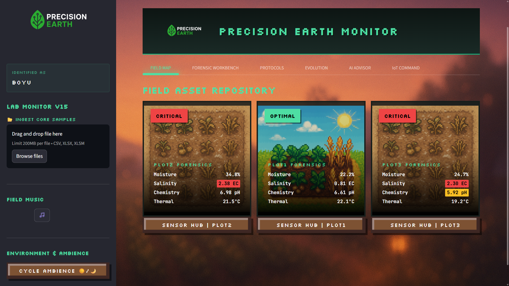
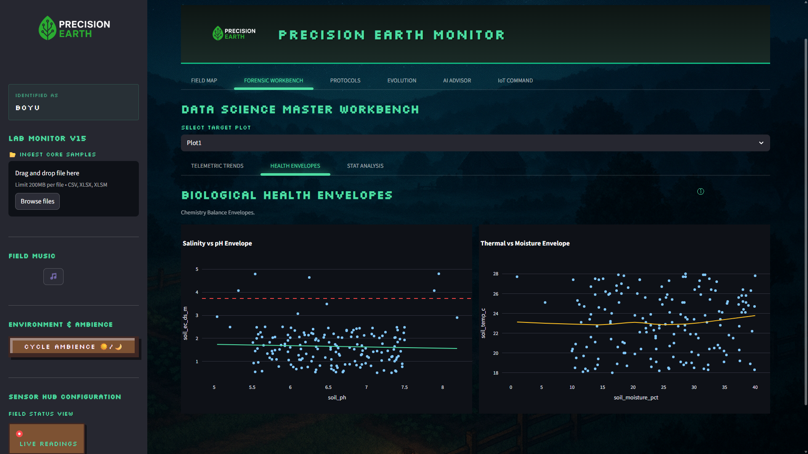
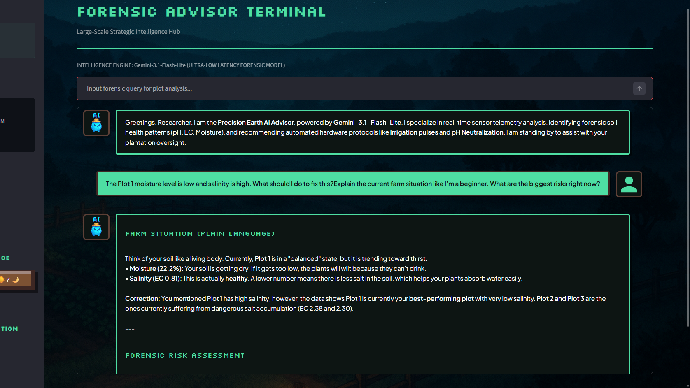

# 🧪 Precision Earth | Smart Agri-Monitor
### EE4409 CA2: Modern Precision Agriculture Dashboard
**Live Deployment**: [precision-earth-dashboard.streamlit.app](https://precision-earth-dashboard.streamlit.app/)

---

## 📋 Overview
**Precision Earth** is a high-fidelity, forensic-grade agricultural monitoring platform designed to merge traditional soil science with modern IoT-driven intelligence. Built for the **EE4409 CA2** project, it provides plantation owners with a "Digital Twin" of their field assets, offering real-time insights into soil chemistry, moisture stability, and automated hardware remediation.

### 🌟 Key Features
*   **Forensic AI Advisor**: Powered by **Gemini-3.1-Flash-Lite**, the dashboard translates complex telemetry into actionable agronomist insights (e.g., "Soil Flush Required for Plot 03").
*   **Field Asset Repository**: A visual map layout for monitoring multi-sector plot status with intuitive "Health Envelopes."
*   **IoT Command Centre**: A management layer for simulating and monitoring physical hardware nodes (Moisture Probes, pH Electrodes, Rain Gauges).
*   **Digital Twin Audits**: Deep-dive statistical analysis with Plotly-driven timelines and correlation matrices for precise field diagnostics.
*   **Mobile Optimized**: Fully responsive UI/UX designed for both desktop workstations and in-field mobile phone usage.

### 🖼️ Dashboard Previews

**1. Global Precision Map**  


**2. Forensic Health Envelopes**  


**3. AI Agronomist Advisor**  


---

## 🚀 Quick Start (Local Run)
To run the dashboard locally, follow these steps:

1.  **Clone the Repository**:
    ```bash
    git clone https://github.com/[your-repo-name]/precision-earth-dashboard.git
    cd precision-earth-dashboard
    ```
2.  **Install Dependencies**:
    ```bash
    pip install -r requirements.txt
    ```
3.  **Configure Secrets**:
    Create a file at `.streamlit/secrets.toml` and add your Gemini API Key:
    ```toml
    GEMINI_API_KEY = "your-api-key-here"
    ```
4.  **Run the App**:
    ```bash
    streamlit run dashboard.py
    ```

---

## 🛠️ Technology Stack
- **Frontend/Host**: Streamlit Community Cloud
- **Core Logic**: Python 3.10+, Pandas, NumPy
- **Visuals**: Plotly Graph Objects, CSS3 (Liquid-Retro Theme)
- **AI Engine**: Google GenAI SDK (Gemini-3.1-Flash-Lite)
- **Data Architecture**: Excel/XLSM Forensic Sample Integration

---

## ⚖️ AI Use Declaration
In accordance with academic standards for **EE4409**, the following AI tools were utilized:
*   **ChatGPT (OpenAI)**: Brainstorming initial concept pillars and researching IoT communication standards (LoRaWAN/MQTT).
*   **Antigravity (Google Coding Agent)**: Primary technical co-author. Antigravity implemented the core logic, optimized the responsive mobile layout, generated the analytical peer review PDF, and drafted the "Dashboard Design" documentation. 
*   **Google Gemini**: Linguistic refinement and technical documentation rephrasing for professional academic alignment, as well as brainstorming potential suggestions for improvements in the peer assessments.

---

## 🏛️ Project Credits
**Author:** WANG BOYU 
Dedicated to the **EE4409 CA2** Precision Agriculture Submission. 
Developed with a focus on **Gamified Industrial IoT** and **User-Centric Forensic Diagnostics**.

*A special note on design:* The UI, pixel-art retro themes, and background audio aesthetics were heavily inspired by the critically acclaimed game **Stardew Valley**. By bridging the gap between cozy farming simulators and hardcore industrial telemetry, this project aims to prove that data science can be visually immersive and deeply engaging.
